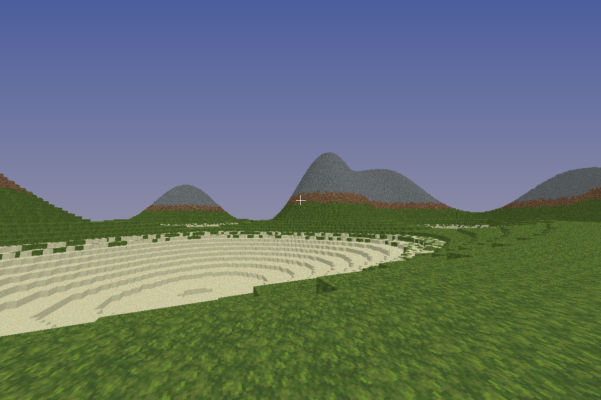
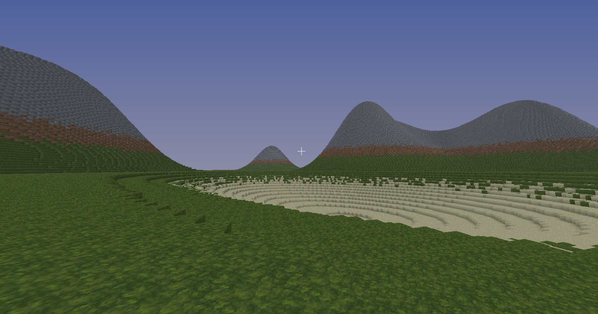

# OpenCraft Unlimited

**Мова розробки:** C#  
**Графічна бібліотека:** OpenTK

OpenCraft Unlimited — це експериментальна sandbox-гра з безкінечним світом, натхненна voxel‑іграми. Проєкт знаходиться на ранній стадії розробки та демонструє базову механіку пересування, генерації світу, рендерингу чанків і взаємодії з блоками.

---

## Assets

This project uses some textures from the Faithful Resource Pack  
© Faithful Team — https://faithfulpack.net/  
Used under Faithful License v3

---

## Можливості

- Безкінечний світ по всіх осях (X, Y, Z)  
- Процедурна генерація світу на основі сторонньої бібліотеки  
- Система чанків з динамічним завантаженням і вивантаженням  
- Рендер кількох чанків навколо гравця  
- Знищення та встановлення блоків  
- Прості елементи відлагодження (координати камери та блоків)  
- Простий градієнт неба на фоні  

---

## Керування

- **W, A, S, D** — рух  
- **CTRL** — прискорення  
- **Пробіл (Space)** — стрибок  

- **Ліва кнопка миші** — ламати блоки  
- **Права кнопка миші** — ставити блоки

- **С** — приближення, зменшення поля зору

- **E** — показати координати камери  
- **Q** — показати координати блока, на який наведено хрестик  

---

## Світ і чанки

- Світ є **безкінечним по кожній осі**  
- Рендериться по **8 чанків у кожну сторону** від гравця в порядку мінімальної відстані
- Усі чанки зберігаються у памʼяті, поки їх кількість не перевищить **50 000**
- Після перевищення ліміту автоматично видаляється **найдальший чанк**  

---

## Скриншоти

---

## Ліцензія

MIT
